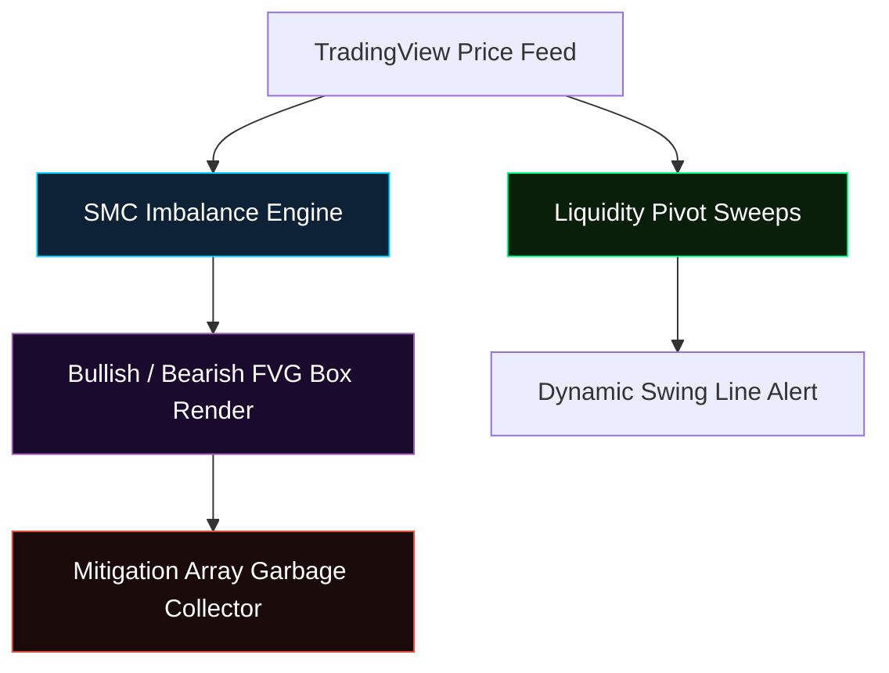

# Quantech Innovation — FVG & Liquidity Sweep Toolkit (Pine Script v6)

> **Enterprise-Grade Market Structure Analysis & Trading Signals Automation Engine for TradingView.**

---

## 📈 Component Overview

This toolkit provides a highly optimized, type-safe, and low-lag market structure engine compiled strictly inside the **Pine Script v6** namespace. It automates real-time detection, tracking, and mitigation calculations for:

1.  **Fair Value Gaps (FVG)**: Identifies bullish and bearish market imbalances and performs real-time mitigation checks to prevent chart clutter.
2.  **Swing High/Low Pivot Liquidity Sweeps**: Tracks structural key swings and dispatches automated JSON alerts when price sweeps major liquidity pools.



---

## 🛠️ Key Architectural Features

*   **Type-Safe Namespace Structure**: Implements native custom `type FVG` structures to encapsulate box objects, levels, and active bar lifetimes.
*   **Dynamic Garbage Collection**: Automatically cleans up and deletes mitigated boxes from active memory to keep TradingView rendering smooth and eliminate chart lag.
*   **Low-Latency Alert Interface**: Fires structured JSON alert payloads compatible with custom FastAPI Webhook servers and automation bridges.

---

## ⚡ Deployment & Code Implementation

To deploy this indicator, create a new **Indicator** in your TradingView Pine Editor, paste the contents of `indicator.pine` from this repository, and add it to your active chart.

### Webhook JSON Payload Schema
When an alert triggers, the toolkit fires a pre-formatted JSON string containing full signal specifications:

```json
{
  "event": "swing_high",
  "value": 1.0950,
  "currency": "EUR"
}
```

---

## ⚙️ Settings Configuration

*   **Display FVGs**: Toggle visibility of imbalance boxes.
*   **Bullish/Bearish FVG Color**: Custom colors with active transparency adjustments.
*   **Swing Strength (Pivot)**: Configure the lookback period (default: `5` candles) to define structural swing high and low validation strength.

---

*Built by Quantech Innovation — Algorithmic Execution Systems.*
